# Setting up outbound calling, call recording and transcription 

## Exercise 1: Configure the voice channel

### Task 1: Set up a voice workstream

1.  In the **Customer Service admin center**, navigate to the site map
    and select **Workstreams** under **Customer support** group.

2.  Select **+** **New workstream**.

3.  In the **Create a workstream** dialog, enter the following details:

    - **Name**: **Contoso voice workstream**

    - **Type**: Voice

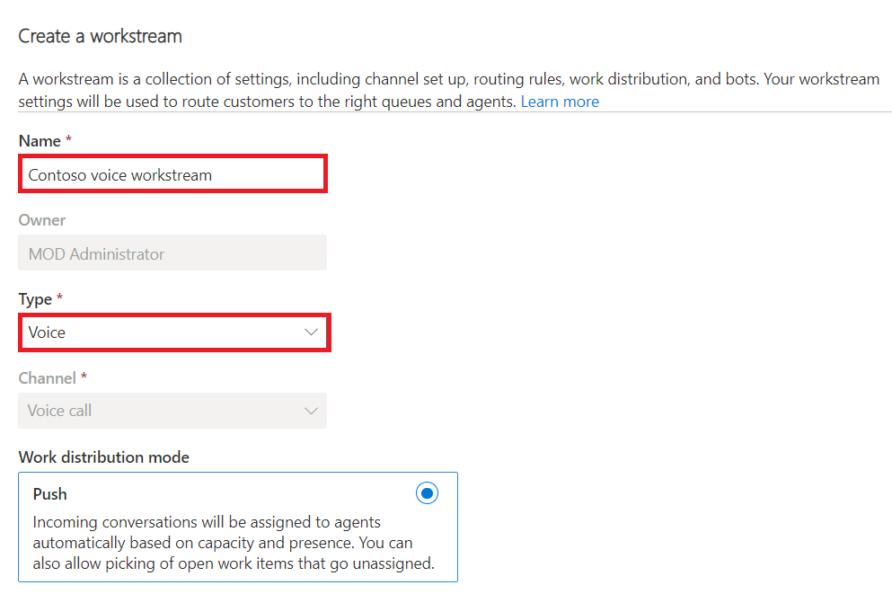

> ***Note***
>
> *By default, **Owner** and **Channel** are predefined and unavailable,
> and only push is available for work distribution mode.*

4.  Select **Create**.

5.  The workstream that you created is displayed with the option to
    configure the selected channel instance.

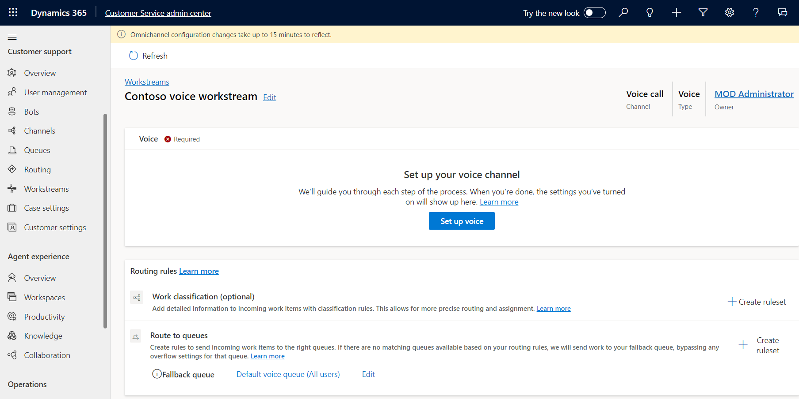

### Task 2: Acquire a phone number

To configure the voice channel, you'll need to associate the workstream
with a phone number for routing the calls. You can view the list of
available phone numbers by selecting **Phone numbers** in the left pane.

1.  Go to **Contoso voice workstream** that you created, and on the page
    that appears, select **Set up voice**.

2.  On the **Voice setup** page, enter **Contoso Voice Channel** in the
    **Name** field. Select **+ Add phone number**.

3.  On the **Phone numbers** page, select **+ New number** to add a new
    phone number.

4.  On the **Add phone number** page, select **United States** for the
    **Country/Region** field.

5.  Select the following values.

[TABLE]

6.  Scroll down and select **Area code**. Select **Find numbers**.

7.  Review the summary and select **Purchase phone number**.

8.  Once the phone number is purchased successfully, select **Done**.

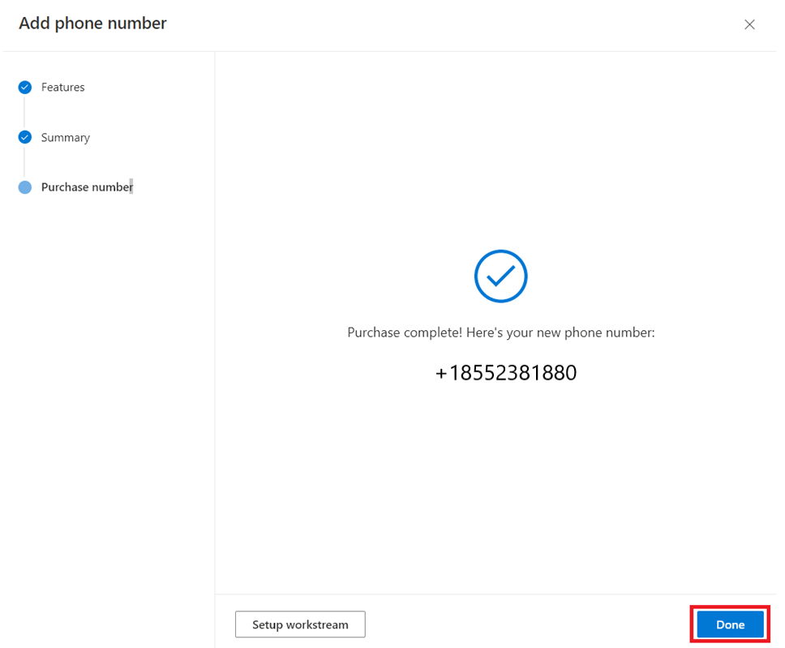

9.  The recently purchased phone number appears on the **Phone numbers**
    page.

### Task 3: Configure a voice channel

1.  In the **Customer Service admin center**, navigate to the site map
    and select **Workstreams** under **Customer support** group.

2.  Select the **Contoso voice workstream** from the list.

3.  On the **Contoso voice workstream** select **Set up voice**.

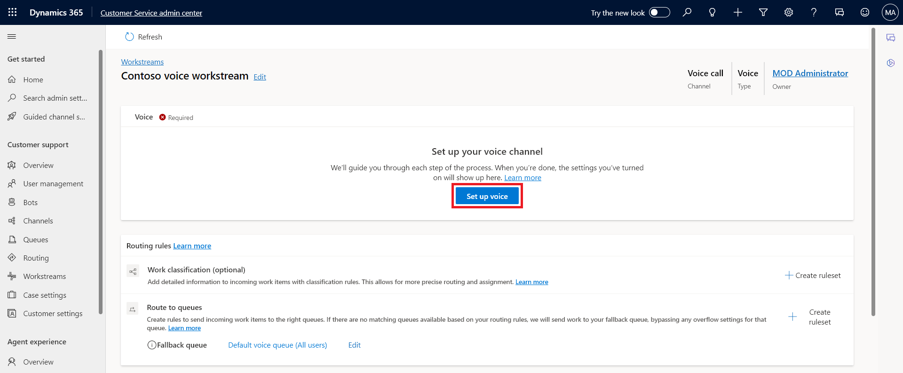

4.  On the **Voice setup** page, enter **Contoso Voice Channel** in the
    **Name** field. Select **Next**.

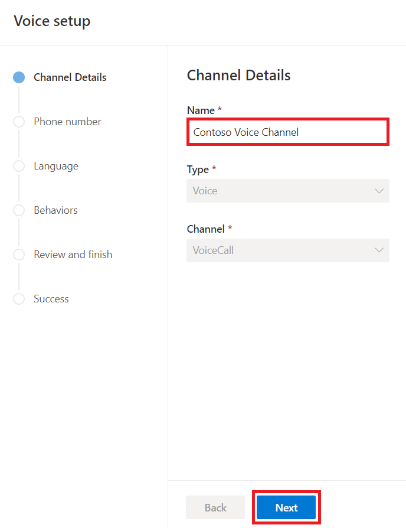

5.  On the **Phone numbers** page, select the number that you have
    purchased in the last task, and select **Next**.

> ** *Note***

- *Only those numbers are displayed that have inbound calls enabled and
  are not already associated with any other workstream.*

&nbsp;

- *The voice channel supports anonymous inbound calls on those numbers
  only that are configured via Azure Communication Services direct
  routing.*

6.  On the **Language** page, select **Add primary language**. 

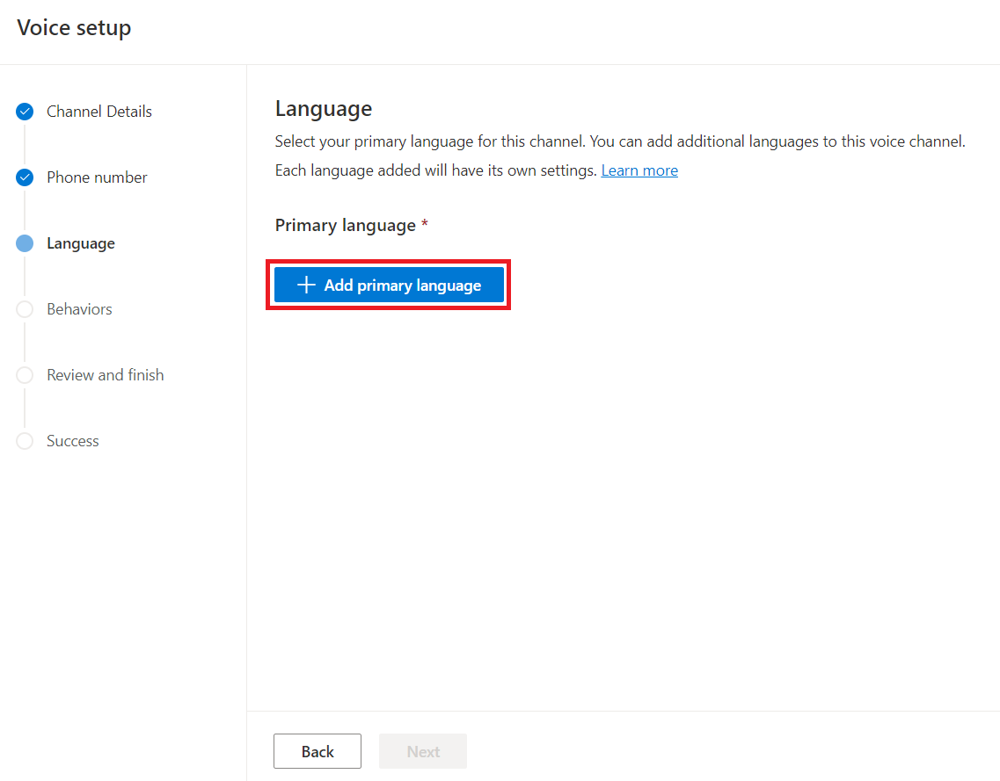

7.  Select your language and other fields and then select **Save and
    close**.

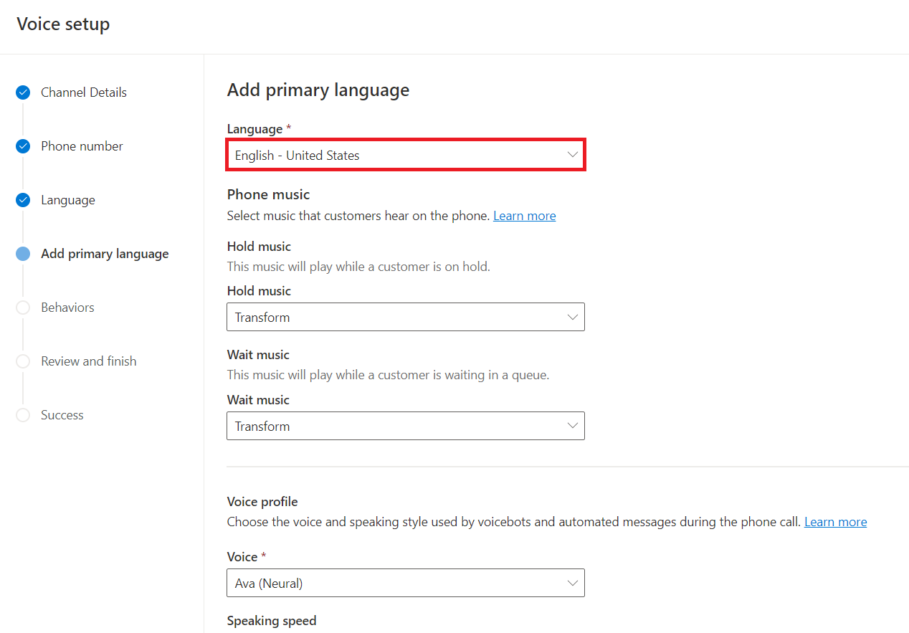

8.  You will be navigated back to the **Language** page. Select
    **Next**.

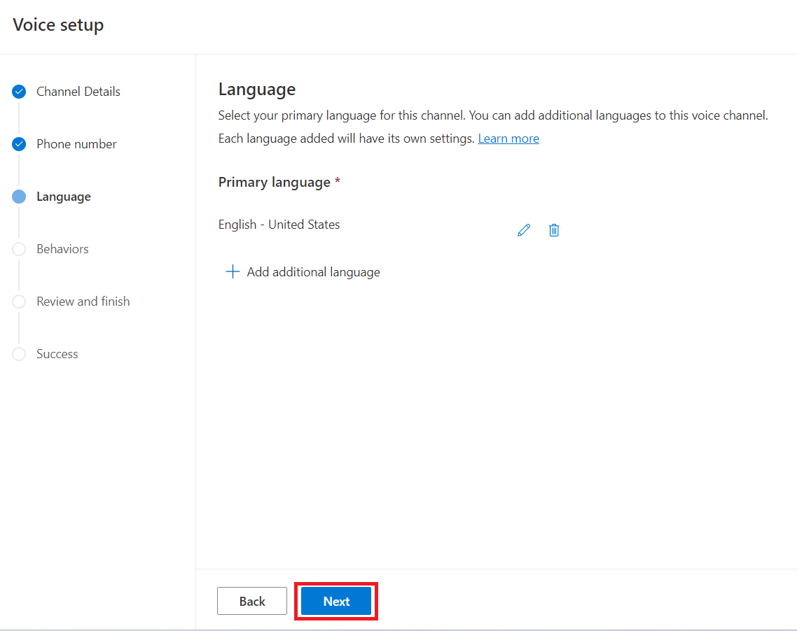

9.  On the **Behaviors** tab, turn on the **Customer wait time** toggle,
    and select the following options:

    - Notify position in queue

    &nbsp;

    - Notify average wait time

10. In the **Transcription and recording** area, select **Transcription
    and recording**.

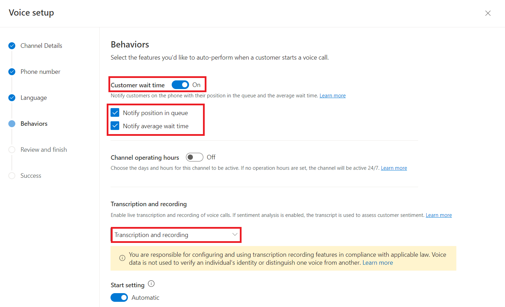

11. Select **+ Add** for **Custom automated messages**.

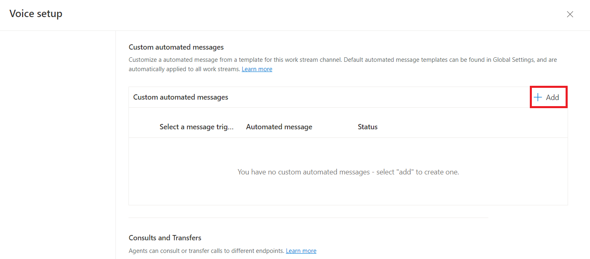

12. On the **Add automated message** page, select **Agent assigned to
    conversation** template as the trigger, and then enter the custom
    automated message text.

13. Select **Confirm**.

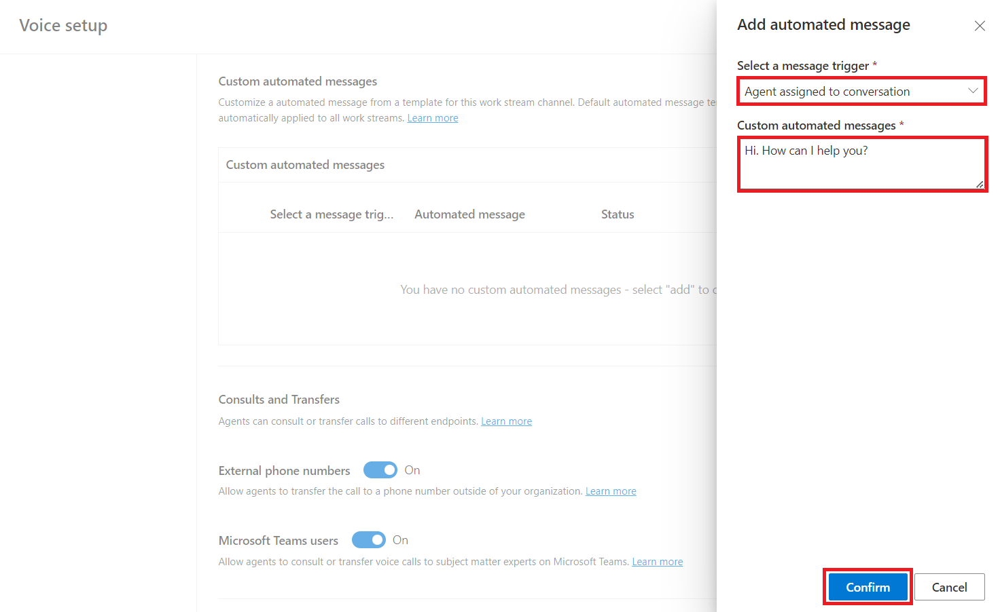

14. Turn on the **Call transfer to external phone number** toggle to
    allow agents to transfer the call to an external number.

15. Turn on the toggle for **External Microsoft Teams
    users(Preview)** to enable the agents to consult other agents on
    **Microsoft Teams**.

16. Select **Next**.

17. On the **Summary** page, select **Create channel**.

18. When the voice channel is successfully created, select **Done**.

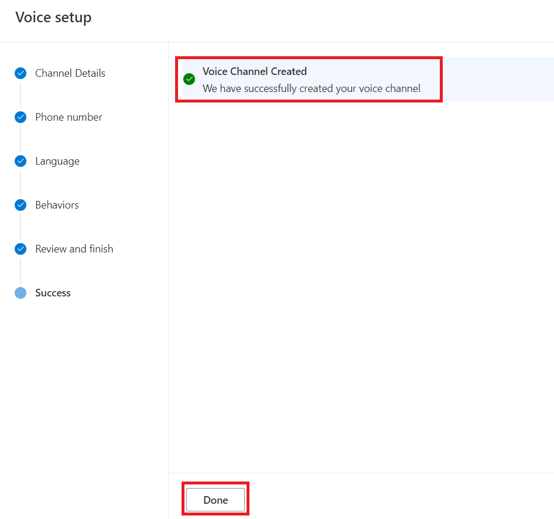

19. The phone number is associated with the workstream.

## Exercise 2: Create a queue for the voice channel

1.  In the **Customer Service admin center**, navigate to the site map
    and select **Queues**.

2.  On the **Queues** page, select **Mange** for **Advanced queues**.

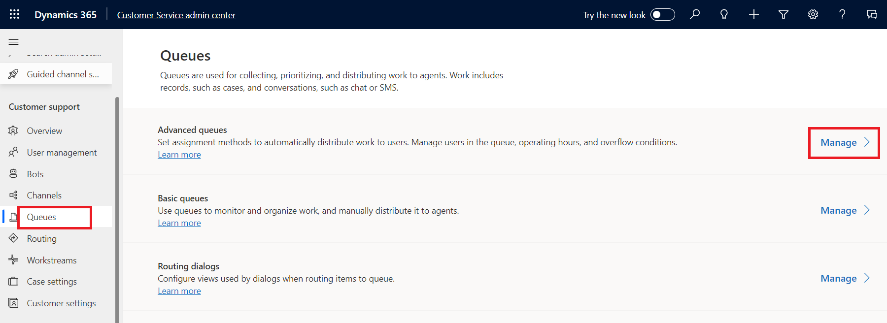

3.  On the **Queues** page, select **+ New queue**.

4.  On **Create a queue** dialog, enter the following details.

    - **Name**: **Test**

    &nbsp;

    - **Type**: Voice

    &nbsp;

    - **Queue Priority**: 1

5.  Select **Create**. The queue is created.

6.  On the **Test** queue page, select **+ Add users**.

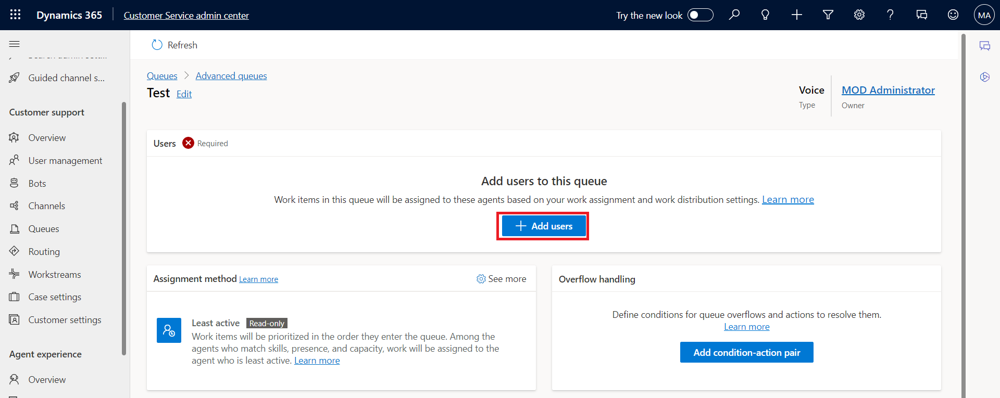

7.  On the **Add users** flyout menu that appears, select **your admin**
    user, and select **Add**.

> ** *Note***

- *You can add only those users who are configured for unified routing.*

&nbsp;

- *After 20 minutes of being added to a queue, agents must refresh their
  dashboards to be able to receive calls.*

8.  In the **Customer Service admin center**, navigate to the site map
    and select **Workstreams** under **Customer support** group.

9.  Select **Contoso voice workstream**.

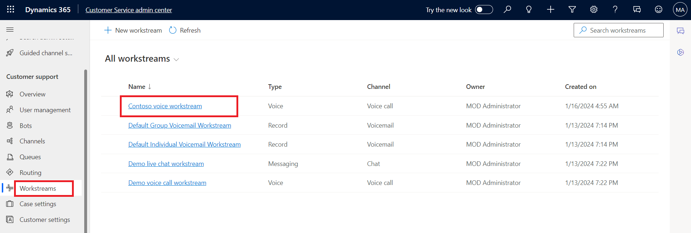

10. On the **Contoso voice workstream**, in **Routing rules** area,
    select **+ Create ruleset** next to **Route to queues**.

11. On the **Create route-to-queues ruleset** dialog, enter **Contoso
    queue** in the **Name** field. Select **Create**.

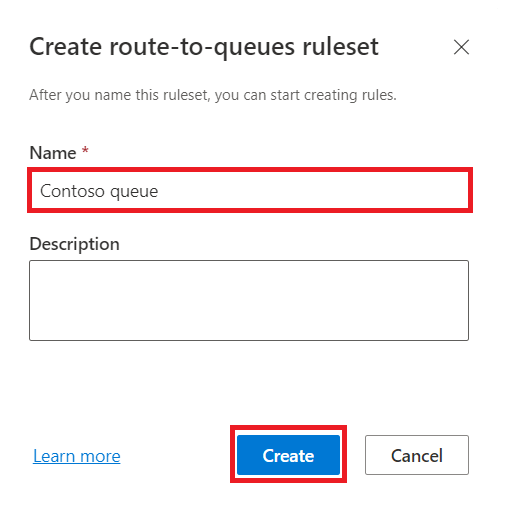

12. On the **Contoso queue** page, select **+ Create rule**.

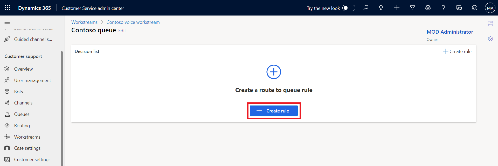

13. On the **Create route to queue rule** page, enter **Contoso queue
    rule** in the **Name** field.

14. Under **Conditions** area, select **+ Add \> Add related entity**.

15. Choose **Phone Call Engagement Context (Conversation)** entity.

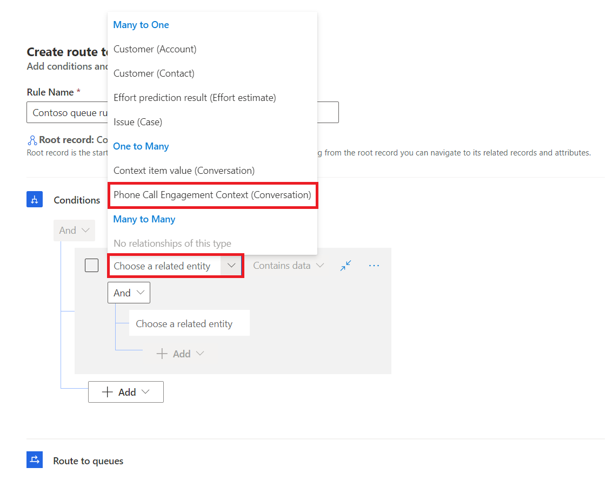

16. Provide the following condition:

> **Customer phone number: Equals: (Your phone number)**

17. Select **Test** for the **Queue** field.

18. Select **Create**.

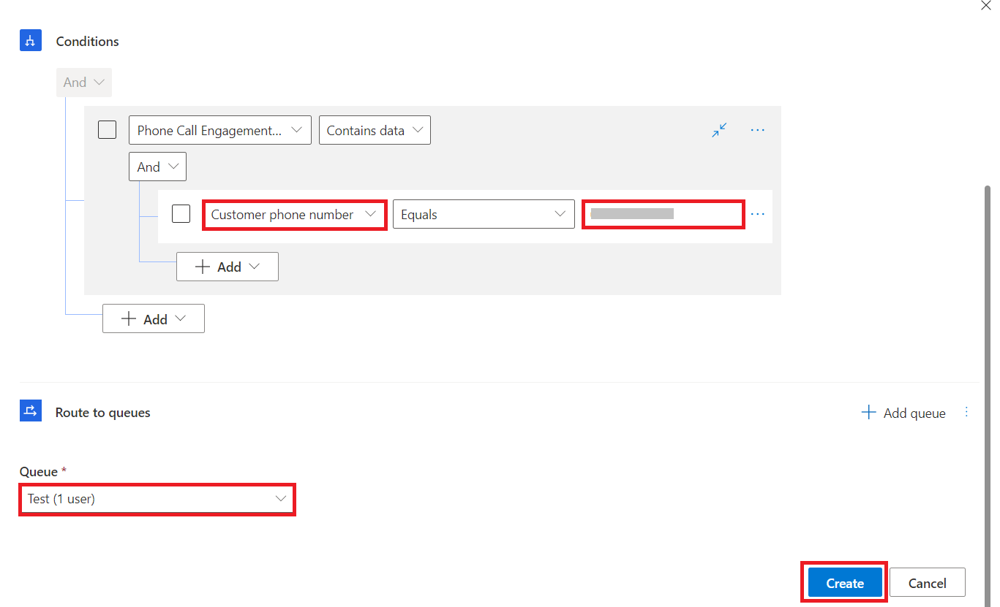

19. The new ruleset is added to **Contoso queue**.

The exercises outlined below can be performed only upon acquiring a paid
license for Omnichannel for Customer Service.

## Exercise 3: Assign personal phone numbers to agents

You can assign personal phone numbers to agents to make outbound calls
to customers.

1.  In the **Customer Service admin center**, navigate to the site map
    and then select **Channels** under **Customer support** group.

2.  On the **Channels** page, select **Manage** for **Phone numbers**.

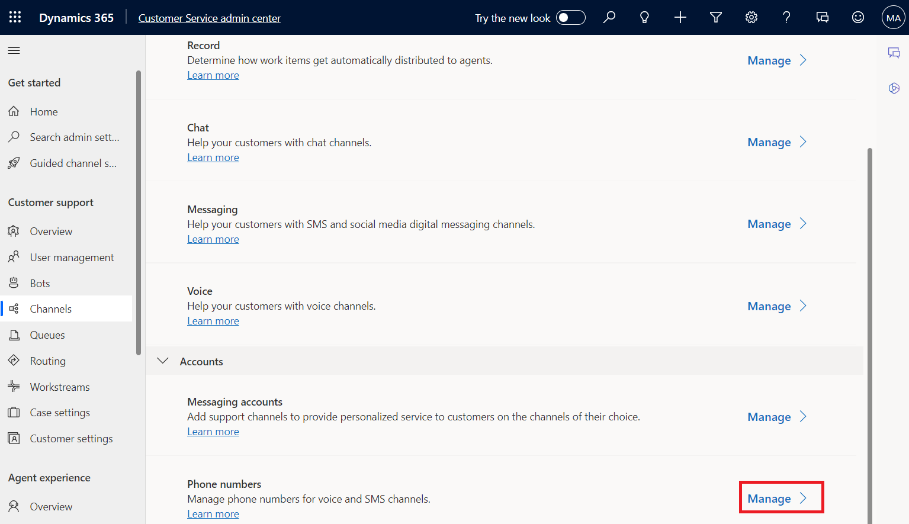

3.  On the **Phone numbers** page, select the phone number which you
    have associated with the **Contoso voice workstream** and then
    select **Setup** in **Ready for setup**.

4.  In the dialog that appears, select **Assign to user**.

5.  The **Omnichannel Users** page displays a list of all agents.

6.  Select your admin as an agent to open the agent details page.

7.  Select the **Omnichannel** tab and select a phone number from
    the **Omnichannel Phone** field. The phone number is now assigned
    exclusively to the agent to call customers.

8.  Select **Save and close**.

** *Note***

- *You can assign to agents local phone numbers only as personal phone
  numbers; toll-free numbers can’t be assigned. Personal agent phone
  number calls always apply the default scoped outbound profile.*

- *You can add only those users who are configured for unified routing.*

- *After 20 minutes of being added to a queue, agents must refresh their
  dashboards to be able to make calls.*

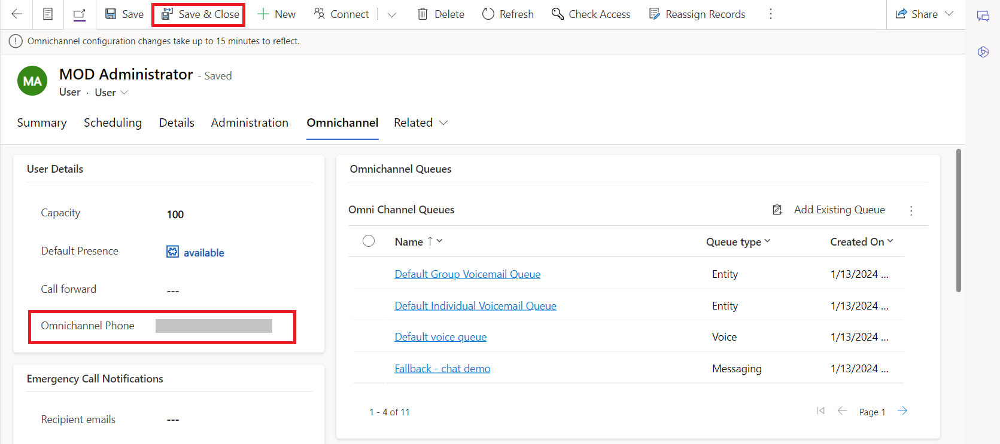

## Exercise 4: Create outbound profiles

You can define how agents use the outbound calls and which agents can
make those calls. If you want a caller ID number that's displayed to
customers to be different from the outbound profile number, configure an
alternative number. It's useful when some settings differ based on the
agent's role while the caller ID number still lists consistently for a
business. You must configure the alternative number other than the
default number as a workstream channel or as an outbound profile number
before you can use it.

1.  In the **Customer Service admin center** site map, select
    **Productivity** under **Agent experience** group.

2.  On the **Productivity** page, select **Manage** for **Outbound and
    inbound profiles**.

3.  Select **+ New profile**.

4.  On the **Create new profile** dialog, in the **Profile
    settings** section, enter **Contoso profile** in **Profile name**
    field, select **Outbound** in **Profile type**, and select **Next**.

5.  In **Phone number**, select a phone number in the **Shared
    numbers** list, and select **Next**.

> ***Note***
>
> *The phone numbers list shows only those numbers that are enabled for
> outbound calling and aren't used as a personal phone number.*

6.  In **Outbound info**, do the following:

    - **Number label**: **Billing**

    &nbsp;

    - **Queue**: Test

    &nbsp;

    - **Capacity**: Default voice outbound

    &nbsp;

    - **Caller ID number**: Select a number from the list.
      The **(Profile Number)** label against the number indicates that
      the caller ID displays the same number as the profile number. It's
      also the default setting.

7.  In **Outbound behaviors**, do the following and then select
    **Next**.

    - **Allow list for countries/regions**: Allow list for
      countries/regions* *

    &nbsp;

    - **Hold music**: Select a music file that you want played when the
      customer is put on hold during a call.

    &nbsp;

    - **Wait music**: Select a music file that you want played when the
      customer is waiting to get into a call.

    &nbsp;

    - **Call transfer to external phone number**: Set the toggle
      to **On** 

    &nbsp;

    - **Consult with Microsoft Teams user**: Set the toggle to **On** 

    &nbsp;

    - **Transcription and recording**: Transcription and recording

    &nbsp;

    - **Start setting**: Keep default setting, which is **Off**.

    &nbsp;

    - **Allow agents to pause and resume**: Keep default setting, which
      is **On**.

8.  Select **Save and close**.

9.  The **Contoso profile** is now created.

## Exercise 5: Enable call recording and transcription for voice

1.  In the **Customer Service admin center**, navigate to the site map
    and select **Workstreams**.

2.  On the **Workstreams** page, select **Contoso voice workstream** for
    which you want to enable recording and transcription.

3.  In the **Phone number** section, next to the pencil icon,
    select **Edit**.

4.  On the **Voice settings** page, select the **Behaviors** tab.

5.  In the **Transcription and recording** section, select
    the **Transcript and recording** dropdown menu, and then
    select **Transcription and recording**.

6.  Under **Start setting**, set the toggle to **Automatic** if you want
    calls to be automatically recorded and transcribed when they begin.

7.  Set **Allow agents to pause and resume** if you want to allow agents
    to control the portions of conversations that they record and
    transcribe.

8.  Select **Save**.

