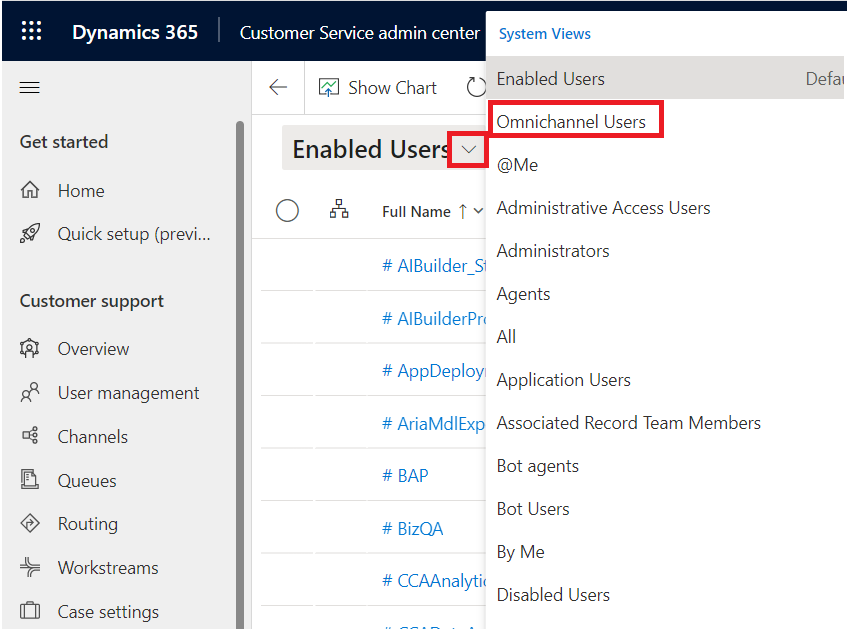
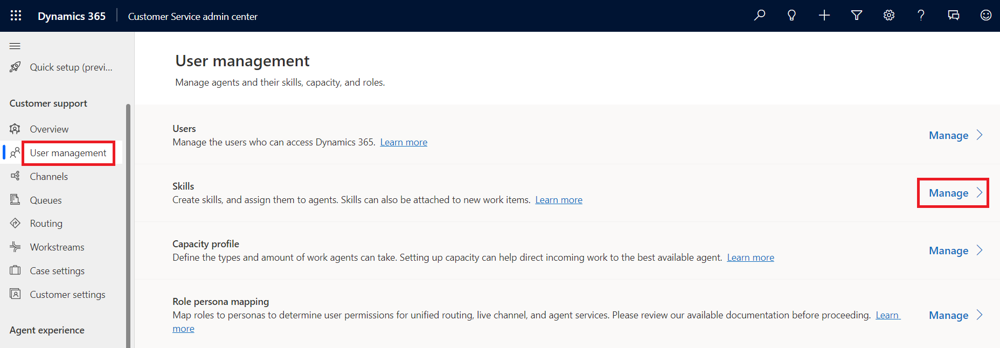
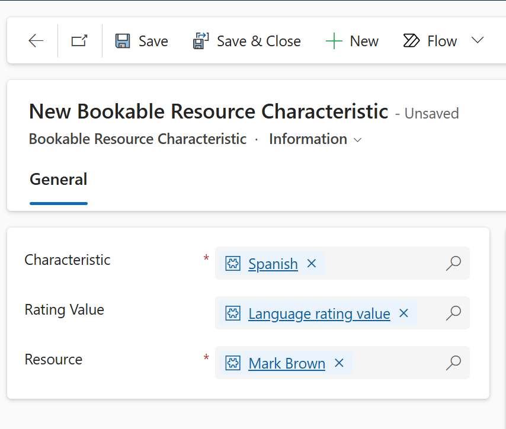

# Lab 8 - Set up skill-based routing in unified routing

**Objective** - You will set up skill-based routing in unified routing.

## Task 1: Create skills

1.  In the **Customer Service admin center** navigate to the site map
    and select **User management** under **Customer support** group.

2.  On the **User management** page, select **Manage** next to
    **Skills**.

    

3.  Select **+ New**.

    

4.  Specify the following in the **New Characteristic** page.

    **Name** - !!Spanish!!

    **Type** - Skill

    **Description** - !!This record is used to define the skill level of the Spanish language!!

5.  Select **Save & Close**.

    

## Task 2: Create a rating model and rating value

1.  In the **Customer Service admin center** navigate to the site map
    and select **Routing** under **Customer support** group.

2.  Select **Manage** next to the **Skill-based routing**.

    

3.  On the **Omnichannel Configuration** page, set the toggle for **Enable update skill control** to **Yes**. In the **Rating
    Model** section, select **+ New Rating Model**.

    

4.  Specify the following in the **New Rating Model** page.

    **Name** - !!Language rating model!!

    **Min Rating Value** - !!1!!

    **Max Rating Value** - !!10!!

5.  Select **Save**.

    

6.  The **Rating Values** section appears. Select **+** **New Rating
    Value**.

    

7.  The **New Rating Value** page appears.

8.  Specify the following.

    **Name** - !!Language rating value!!

    **Value** - !!10!!

9.  Select **Save & Close** to save and add the rating value to the
    grid.

    

10. Select **Save & Close** on the top of Language rating model page to
    navigate back to the Omnichannel Configuration page.

    

11. On the **Omnichannel Configuration** page, click **Save & Close**

    

## Task 3: Add agent as bookable resource

1.  In **Dynamics 365 Customer Service admin center**, in the site map,
    select **User management** under **Customer support** group.

2.  On the **User management** page, select **Manage** next
    to **Users**.

    

3.  Click the dropdown next to **Enabled Users** and select
    **Omnichannel Users**.

    

4.  On the **Omnichannel Users** page, select your admin from the
    list.

5.  Select the **Omnichannel** tab.

6.  Select **+** **New Bookable Resource** under the **Skills
    Configuration** section.

    

7.  Enter the following details on the **New Bookable Resource** page.

    1.  **Name** – !!Mark Brown!!

    2.  **Time Zone** - Central Time (US & Canada)

    3.  Select **Save**.

    

8.  Click the **Work Hours** tab to see the details of the agent **Mark
    Brown**.

    

9.  Select the **General** tab and then select **Save & Close** to
    navigate back to your admin User page.

    

10.  On the **MOD Administrator** page, select **Save & Close**.

    

## Task 4: Assign agents to skill

1.  In the **Customer Service admin center** navigate to the site map
    and select **User management** under **Customer support** group.

2.  On the **User management** page, select **Manage** next
    to **Skills**.

    

3.  Select a skill **Spanish** from the list for which you want to
    assign the agents.

    

4.  Select **+ New Bookable Resource Characteristic** in the **Users
    (Agents)** section.

    

5.  On the **New Bookable Resource Characteristic** page, select **Language
    rating value** for the **Rating Value** field and select **Mark
    Brown** for the **Resource** field.

6.  Select **Save and Close**.

    

7.  On the **Spanish** Characteristic page, select **Save**.

    

**Summary** - You have successfully configured and set up skill-based routing in unified routing
